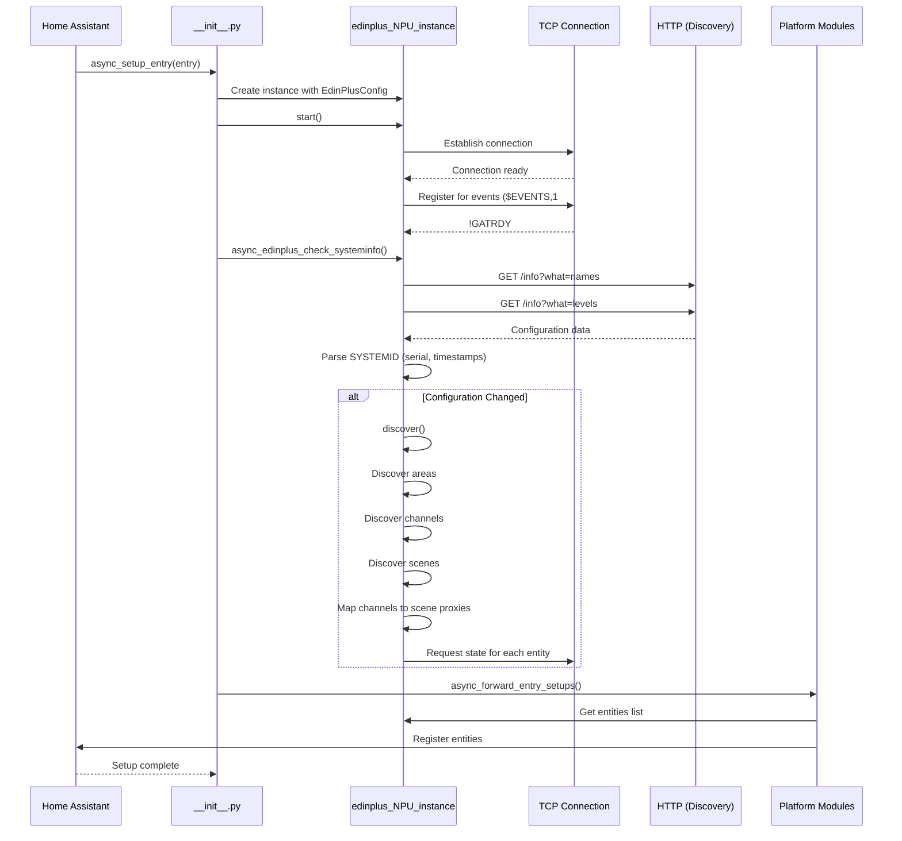

# eDIN+ Integration Development Guide

This document explains the architecture, data flows, and implementation details of the eDIN+ Home Assistant integration for future developers.

## Table of Contents
1. [Architecture Overview](#architecture-overview)
2. [Key Components](#key-components)
3. [Initialization Flow](#initialization-flow)
4. [Discovery Process](#discovery-process)
5. [Communication Protocols](#communication-protocols)
6. [Entity Types](#entity-types)
7. [Event System](#event-system)
8. [Background Tasks](#background-tasks)
9. [Error Handling](#error-handling)
10. [Development Tips](#development-tips)

---

## Architecture Overview

The eDIN+ integration follows a hub-and-spoke model where:
- **Hub (NPU)**: The Network Processing Unit that manages all eDIN+ devices via MBus
- **Entities**: Individual devices (lights, switches, buttons, sensors, scenes) connected to the NPU
- **Communication**: Dual protocol approach using HTTP for discovery and TCP for real-time state updates

### Design Philosophy
- **Separation of Concerns**: Core eDIN+ logic in `edinplus.py` contains no Home Assistant dependencies, making it reusable as a standalone library
- **Event-Driven**: Uses callback registration pattern for state updates
- **Resilient**: Automatic reconnection with exponential backoff
- **Push-Based**: TCP stream provides real-time updates rather than polling

---

## Key Components

### 1. `__init__.py` - Integration Entry Point
**Purpose**: Manages the lifecycle of the integration within Home Assistant.

**Responsibilities**:
- Creates `EdinPlusConfig` from user input
- Instantiates `edinplus_NPU_instance`
- Coordinates initialization sequence
- Forwards platform setup to entity modules
- Handles unload/cleanup

**Key Flow**:
```python
async_setup_entry()
  ↓
1. Create config and NPU instance
2. Start TCP connection (start())
3. Fetch system info (async_edinplus_check_systeminfo())
   ↓ triggers discovery if config changed
4. Forward to platform modules (light, switch, etc.)
```

### 2. `edinplus.py` - Core Client Library
**Purpose**: Platform-agnostic TCP/HTTP client for eDIN+ NPU communication.

**Key Classes**:
- `EdinPlusConfig`: Configuration dataclass
- `edinplus_NPU_instance`: Main connection manager
- `edinplus_dimmer_channel_instance`: Dimmable light channel
- `edinplus_relay_channel_instance`: Relay switch channel
- `edinplus_relay_pulse_instance`: Momentary relay button
- `edinplus_input_binary_sensor_instance`: Contact input sensor

### 3. `config_flow.py` - User Setup Flow
**Purpose**: Handles the Home Assistant configuration UI for adding the integration.

**Validation Steps**:
1. Hostname length check
2. TCP port range validation (1-65535)
3. Creates test `edinplus_NPU_instance` to verify configuration
4. Returns configuration to be stored by Home Assistant

### 4. Platform Modules
Each platform (light, switch, button, binary_sensor, scene) follows the same pattern:
- **async_setup_entry()**: Retrieves NPU from hass.data, creates entity wrappers
- **Entity Class**: Wraps low-level channel instance with Home Assistant entity interface
- **Callbacks**: Registers `async_write_ha_state` for push updates

### 5. `device_trigger.py` - Automation Events
**Purpose**: Exposes button/input events as device triggers for Home Assistant automations.

**Supported Devices**:
- Wall plates (LCD and button panels)
- Contact input modules
- I/O modules

**Trigger Types**:
- Release-off, Press-on, Hold-on, Short-press, Hold-off
- Keypad specific: "Button 1 Press-on", "Button 2 Release-off", etc.

---

## Initialization Flow

### Detailed Sequence



### Critical Ordering

1. **TCP Connection MUST be established before discovery** - The discovery process calls `tcp_force_state_inform()` which requires an active writer
2. **System info check triggers discovery** - Discovery only runs if edit/adjust timestamps change
3. **Platform setup happens last** - Entities must be discovered before platform modules try to access them

---

## Discovery Process

### HTTP-Based Discovery
The NPU exposes two HTTP endpoints that provide all configuration data:

#### `/info?what=names`
CSV-like format containing:
- `AREA,AreaNum,AreaName` - Physical areas/rooms
- `CHAN,Address,DevCode,ChanNum,AreaNum,ChanName` - Output channels (lights, relays)
- `INPSTATE,Address,DevCode,ChanNum,AreaNum,InputName` - Input channels (contacts)
- `PLATE,Address,DevCode,AreaNum,PlateName` - Wall plate devices

#### `/info?what=levels`
CSV-like format containing:
- `!SYSTEMID,Serial,EditStamp,AdjustStamp` - Configuration versioning
- `AREA,AreaNum,AreaName` - Area definitions
- `SCENE,SceneNum,AreaNum,SceneName` - Scene definitions
- `SCNFADE,SceneNum,FadeTime` - Scene fade times
- `SCNCHANLEVEL,SceneNum,Address,DevCode,ChanNum,Level` - Scene channel levels

### Discovery Methods

#### `async_edinplus_discover_areas()`
Parses area definitions and returns a dictionary: `{area_num: area_name}`

#### `async_edinplus_discover_channels()`
Identifies and creates instances for:
1. **Dimmer Channels** (DevCode 12, 14, 15) → `edinplus_dimmer_channel_instance`
2. **Relay Channels** (DevCode 16) → `edinplus_relay_channel_instance` + `edinplus_relay_pulse_instance`
3. **Binary Sensors** (DevCode 9, 15) → `edinplus_input_binary_sensor_instance`
4. **Button Plates** (DevCode 1, 2) → Device trigger only (no entity created)

#### `async_edinplus_discover_scenes()`
Creates `edinplus_scene_instance` objects for each scene defined in the NPU.

#### `async_edinplus_map_chans_to_scns()`
Identifies scenes containing only a single channel at 100% brightness. These scenes are used as "proxies" when controlling the channel, which provides better integration with Mode wall plates (they can detect scene recalls but not direct channel commands).

### Rediscovery
The `_systeminfo_loop()` background task periodically checks the edit and adjust timestamps. If they change, full rediscovery is triggered automatically.

---

## Communication Protocols

### TCP Protocol (Port 26)
**Purpose**: Real-time bidirectional communication for state updates and control.

#### Message Format
- ASCII text messages
- Terminated with `;` and `\n`
- Commands start with `$`, queries with `?`, responses with `!`

#### Key Commands
```
$EVENTS,1;              # Register for all event notifications
$ChanFade,Addr,Dev,Chan,Level,FadeTime;  # Set channel level
$SCNRECALL,SceneNum;    # Recall scene
$SCNOFF,SceneNum;       # Turn off scene
$OK;                    # Keep-alive ping
?CHAN,Addr,Dev,Chan;    # Query channel state
?INP,Addr,Dev,Chan;     # Query input state
```

#### Key Responses
```
!GATRDY;                # Gateway ready
!CHANFADE,Addr,Dev,Chan,Level;  # Channel level update
!CHANLEVEL,Addr,Dev,Chan,Level; # Channel level (static)
!INPSTATE,Addr,Dev,Chan,State;  # Input state change
!BTNSTATE,Addr,Dev,Chan,State;  # Button event
!MODULEERR,Addr,Dev,Status;     # Module error
!CHANERR,Addr,Dev,Chan,Status;  # Channel error
```

### HTTP Protocol (Port 80)
**Purpose**: Read-only discovery and configuration retrieval.

#### Endpoints
- `/info?what=names` - Device and channel names
- `/info?what=levels` - Configuration and scene levels
- `/gateway?1` - Alternative gateway interface (not currently used)

---

## Entity Types

### Lights (`edinplus_dimmer_channel_instance`)
**Control Methods**:
- `turn_on()` - Full brightness (via scene proxy if available, else direct)
- `turn_off()` - Off (via scene proxy if available, else direct)
- `set_brightness(0-255)` - Set specific level

**State Properties**:
- `is_on` - Boolean on/off state
- `brightness` - Current brightness (0-255)

**Scene Proxy Behavior**:
When a channel has a unique scene containing only itself at 100%:
- Uses `$SCNRECALL` instead of `$ChanFade` for on
- Uses `$SCNOFF` instead of `$ChanFade,0` for off
- Uses `$SCNRECALLX` with level parameter for brightness
- Provides better integration with wall plates

### Switches (`edinplus_relay_channel_instance`)
**Control Methods**:
- `turn_on()` - Close relay (level 255)
- `turn_off()` - Open relay (level 0)

**State Properties**:
- `is_on` - Boolean relay state

### Buttons (`edinplus_relay_pulse_instance`)
**Control Methods**:
- `press()` - Sends `$ChanPulse` command with configurable pulse time (default 1000ms)

**Use Cases**:
- Garage door triggers
- Momentary contactors
- Pulse-based automation devices

### Binary Sensors (`edinplus_input_binary_sensor_instance`)
**State Properties**:
- `is_on` - Boolean contact state (True = closed/triggered)

**Update Mechanism**:
State changes arrive via TCP `!INPSTATE` messages and trigger registered callbacks.

### Scenes (`edinplus_scene_instance`)
**Control Methods**:
- `activate()` - Recalls the scene via `$SCNRECALL`

**Properties**:
- `scene_num` - Unique identifier
- `name` - Human-readable name
- `area` - Associated area number

---

## Event System

### Device Events (Button Presses)
The integration uses Home Assistant's device automation system for input events.

#### Event Flow
```
NPU → TCP !BTNSTATE/!INPSTATE 
  ↓
async_response_handler()
  ↓
_dispatch_button_event()
  ↓
device_trigger.py callbacks
  ↓
Home Assistant automation engine
```

#### Event Data Structure
```python
{
    "device_uuid": "edinplus-{serial}-{address}-{channel}",
    "type": "Press-on" | "Release-off" | "Hold-on" | "Short-press" | "Hold-off"
}
```

#### Keypad vs Contact Modules
- **Keypads**: Single device with multiple button events ("Button 1 Press-on", etc.)
- **Contact Modules**: Each input is a separate device with state events

### State Update Callbacks
Entities use callback registration for push-based state updates:

```python
light.register_callback(self.async_write_ha_state)
```

When the NPU sends a state change:
1. TCP message parsed in `async_response_handler()`
2. Corresponding entity instance updated
3. All registered callbacks invoked
4. Home Assistant entity state refreshed

---

## Background Tasks

The NPU instance runs three concurrent background tasks:

### 1. Monitor Loop (`_monitor_loop()`)
**Purpose**: Continuously reads from TCP stream and dispatches messages.

**Behavior**:
- Calls `_ensure_connected()` to maintain connection
- Reads messages via `tcp_receive_message()`
- Dispatches to `async_response_handler()`
- Handles EOF by triggering reconnection
- Recovers from network errors automatically

### 2. Keep-Alive Loop (`_keepalive_loop()`)
**Purpose**: Prevents TCP connection timeout (NPU closes after ~3600s idle).

**Interval**: 1800 seconds (30 minutes) by default

**Behavior**:
- Sends `$OK;` command
- Expects acknowledgment response
- Tracks retry attempts (max 5)
- Closes connection if max retries exceeded
- Monitor loop will then trigger reconnection

### 3. System Info Loop (`_systeminfo_loop()`)
**Purpose**: Detects configuration changes and triggers rediscovery.

**Interval**: 600 seconds (10 minutes) by default

**Behavior**:
- Fetches `/info?what=levels` via HTTP
- Parses `!SYSTEMID` for edit/adjust timestamps
- Compares with cached values
- Triggers `discover()` if changed
- Updates serial number on first run

### Task Management
All tasks are:
- Created in `start()`
- Cancelled in `stop()`
- Cooperative with `asyncio.CancelledError`
- Respect the `_stop_event` flag

---

## Error Handling

### Connection Resilience

#### Initial Connection
- Exponential backoff on failure (5s → 10s → 20s → ... → 300s max)
- Respects `_stop_event` to allow graceful shutdown
- Logs connection attempts for debugging

#### Reconnection
- Triggered by:
  - EOF on TCP stream
  - Keep-alive timeout
  - Network errors
- Uses same exponential backoff strategy
- Preserves entity instances (no re-discovery needed)

### NPU Error Messages

#### Module Errors (`!MODULEERR`)
```
!MODULEERR,Address,DevCode,StatusCode;
```
Logged as warnings with human-readable descriptions from `STATUSCODE_TO_DESC`.

#### Channel Errors (`!CHANERR`)
```
!CHANERR,Address,DevCode,Channel,StatusCode;
```
Logged with channel-specific context.

### Safety Checks

#### TCP Writer Availability
All `tcp_force_state_inform()` methods check:
```python
if self.hub.writer is None or not self.hub.online:
    return  # Skip request if not connected
```

#### Discovery Validation
- Checks for device codes in known mapping tables
- Logs warnings for unknown device types
- Gracefully skips unsupported devices

---

## Development Tips

### Adding a New Device Type

1. **Add device code mapping** in `const.py`:
   ```python
   DEVCODE_TO_PRODNAME[XX] = "New Device Type"
   ```

2. **Create entity class** in `edinplus.py`:
   ```python
   class edinplus_new_device_instance:
       def __init__(self, address, channel, name, area, model, devcode, npu):
           # Initialize
   ```

3. **Add to discovery** in `async_edinplus_discover_channels()`:
   ```python
   elif channel_entity['devcode'] == XX:
       new_device_instances.append(edinplus_new_device_instance(...))
   ```

4. **Create platform module** (e.g., `new_device.py`):
   ```python
   async def async_setup_entry(hass, config_entry, async_add_entities):
       npu = hass.data[DOMAIN][config_entry.entry_id]
       async_add_entities(NewDeviceEntity(device) for device in npu.new_devices)
   ```

5. **Add to PLATFORMS** in `__init__.py`:
   ```python
   PLATFORMS = ["light", "switch", ..., "new_device"]
   ```

### Debugging TCP Communication

Enable debug logging in `configuration.yaml`:
```yaml
logger:
  default: info
  logs:
    custom_components.edinplus: debug
```

TCP TX/RX messages will be logged with full message content.

### Testing Discovery
1. Modify edit/adjust stamps manually to trigger rediscovery
2. Check HTTP endpoints directly: `http://<npu-ip>/info?what=names`
3. Monitor logs for parsing errors

### Common Pitfalls

1. **Calling TCP methods before connection established**
   - Always check `hub.writer is not None` or call after `start()`

2. **Forgetting to register callbacks**
   - Entities won't update in HA UI without callback registration

3. **Blocking the event loop**
   - All I/O must be async (use `aiohttp`, `asyncio.StreamReader/Writer`)

4. **Incorrect message termination**
   - All TCP messages must end with `;` and will have `\n` added automatically

5. **Not handling device code variations**
   - Check discovery logs for unknown device codes
   - Add proper handling or log warnings

### Configuration Parameters

All tunable parameters are in `EdinPlusConfig`:
```python
@dataclass
class EdinPlusConfig:
    hostname: str                      # Required
    tcp_port: int = 26                 # Default NPU port
    use_chan_to_scn_proxy: bool = True # Use scene proxies
    keep_alive_interval: float = 1800.0
    keep_alive_timeout: float = 5.0
    systeminfo_interval: float = 600.0
    reconnect_delay: float = 5.0
    max_reconnect_delay: float = 300.0
```

### Code Style
- Follow existing snake_case convention for private methods/properties
- Use type hints for all function parameters and return values
- Log at appropriate levels:
  - `DEBUG`: Detailed state changes, TCP messages
  - `INFO`: Lifecycle events, discovery results
  - `WARNING`: Unexpected but recoverable conditions
  - `ERROR`: Failures requiring attention

---

## Future Development Ideas

1. **Configuration via UI**
   - Expose `EdinPlusConfig` parameters in options flow
   - Allow scene proxy enable/disable per entity

2. **Enhanced Scene Support**
   - Scene state tracking (currently fire-and-forget)
   - Scene brightness adjustment as light entity

3. **DALI Support**
   - Parse DALI fixture errors
   - Expose DALI-specific features

4. **Statistics**
   - Connection uptime
   - Message throughput
   - Error rate tracking

5. **Advanced Discovery**
   - Detect device capabilities from firmware version
   - Auto-configure based on detected features

6. **Testing**
   - Unit tests for message parsing
   - Integration tests with mock NPU
   - Fixture-based discovery tests

---

## Resources

- [Mode Lighting eDIN+ Documentation](https://www.modelighting.com)
- [Home Assistant Integration Development](https://developers.home-assistant.io/)
- [Gateway Interface Specification v2.0.3](Contact Mode Lighting for documentation)

---

**Document Version**: 1.0  
**Last Updated**: November 18, 2025  
**Integration Version**: Experimental Branch
